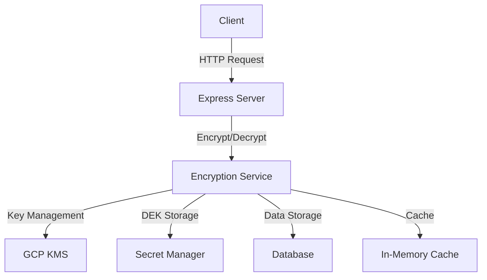
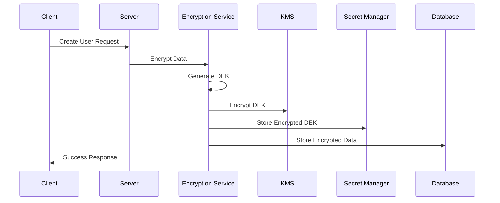
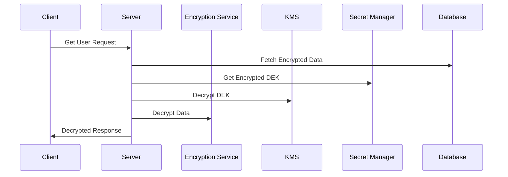

# Encryption-Decryption POC Documentation

## Table of Contents
1. [Project Overview](#project-overview)
2. [Architecture](#architecture)
3. [Technical Stack](#technical-stack)
4. [Data Flow](#data-flow)
5. [API Documentation](#api-documentation)
6. [Security Implementation](#security-implementation)
7. [Database Schema](#database-schema)
8. [Setup and Configuration](#setup-and-configuration)

## Project Overview

This project implements a secure encryption-decryption system using Google Cloud KMS (Key Management Service) and Secret Manager. It provides a robust solution for encrypting sensitive user data while maintaining searchability through hashed fields.

### Key Features
- Field-level encryption for sensitive data
- Secure key management using GCP KMS
- Encrypted DEK storage in Secret Manager
- In-memory caching for improved performance
- Searchable encrypted fields using hashing
- RESTful API endpoints for user management

## Architecture



### Components
1. **Client Layer**
   - REST API endpoints
   - Request validation
   - Response formatting

2. **Service Layer**
   - Encryption Service
   - KMS Service
   - Secret Manager Service

3. **Storage Layer**
   - Database (User data)
   - Secret Manager (DEK storage)
   - In-Memory Cache (Performance optimization)

## Technical Stack

- **Backend Framework**: Node.js with Express
- **Database**: Sequelize ORM
- **Encryption**: 
  - AES-256-GCM for field encryption
  - GCP KMS for key management
  - Secret Manager for DEK storage
- **Authentication**: JWT (if implemented)
- **Caching**: In-memory Map

## Data Flow

### Encryption Flow


### Decryption Flow


## API Documentation

### User Management Endpoints

#### 1. Create User
```http
POST /api/users
Content-Type: application/json

{
    "username": "string",
    "email": "string",
    "password": "string",
    "firstName": "string",
    "lastName": "string"
}
```

#### 2. Search Users
```http
GET /api/users/search?email=string&firstName=string&lastName=string
```

#### 3. Get All Users
```http
GET /api/users
```

## Security Implementation

### Encryption Process
1. **Data Encryption Key (DEK) Generation**
   - 32-byte random key generation
   - Used for field-level encryption

2. **Key Encryption Key (KEK) Management**
   - Managed by GCP KMS
   - Used to encrypt/decrypt DEK

3. **Field Encryption**
   - AES-256-GCM encryption
   - Includes IV and Auth Tag
   - Secure random IV generation

### Security Features
- Field-level encryption
- Secure key management
- Encrypted DEK storage
- Searchable encrypted fields
- In-memory caching with proper security

## Database Schema

### User Table
```sql
CREATE TABLE Users (
    id INTEGER PRIMARY KEY,
    username VARCHAR(255) UNIQUE,
    email_hash VARCHAR(64),
    password VARCHAR(255),
    firstName VARCHAR(255),
    lastName VARCHAR(255),
    createdAt DATETIME,
    updatedAt DATETIME
);
```

### UserKeyDetails Table
```sql
CREATE TABLE UserKeyDetails (
    id INTEGER PRIMARY KEY,
    userId INTEGER,
    locationId VARCHAR(255),
    keyRingId VARCHAR(255),
    keyId VARCHAR(255),
    secretId VARCHAR(255),
    createdAt DATETIME,
    updatedAt DATETIME,
    FOREIGN KEY (userId) REFERENCES Users(id)
);
```

## Setup and Configuration

### Environment Variables
```env
GCP_PROJECT_ID=your-project-id
GOOGLE_APPLICATION_CREDENTIALS=path-to-credentials.json
```

### Configuration Files
1. **encryption.json**
```json
{
    "encryptedFields": {
        "User": {
            "fields": ["password", "email", "email_hash", "firstName", "lastName"],
            "dekLength": 32
        }
    }
}
```

### Installation Steps
1. Clone the repository
2. Install dependencies: `npm install`
3. Set up environment variables
4. Configure GCP credentials
5. Run database migrations
6. Start the server: `npm start`

## Performance Considerations

### Caching Strategy
- In-memory caching of encrypted DEK
- Cache invalidation on updates
- Memory-efficient implementation

### Optimization Techniques
- Batch processing for multiple fields
- Efficient key management
- Optimized database queries

## Error Handling

### Common Error Scenarios
1. Invalid encryption parameters
2. KMS service unavailability
3. Secret Manager access issues
4. Database connection problems

### Error Response Format
```json
{
    "message": "Error message",
    "error": "Detailed error information"
}
```

## Future Enhancements

1. **Planned Features**
   - Redis caching implementation
   - Rate limiting
   - Audit logging
   - Key rotation mechanism

2. **Security Improvements**
   - Additional encryption algorithms
   - Enhanced key management
   - Advanced access controls

## Maintenance and Monitoring

### Monitoring Points
1. Encryption/Decryption performance
2. Cache hit rates
3. API response times
4. Error rates

### Maintenance Tasks
1. Regular key rotation
2. Cache cleanup
3. Log rotation
4. Performance optimization

## Conclusion

This documentation provides a comprehensive overview of the encryption-decryption POC project. The system implements secure data encryption with searchable capabilities while maintaining performance through caching mechanisms. The architecture ensures scalability and maintainability while following security best practices. 